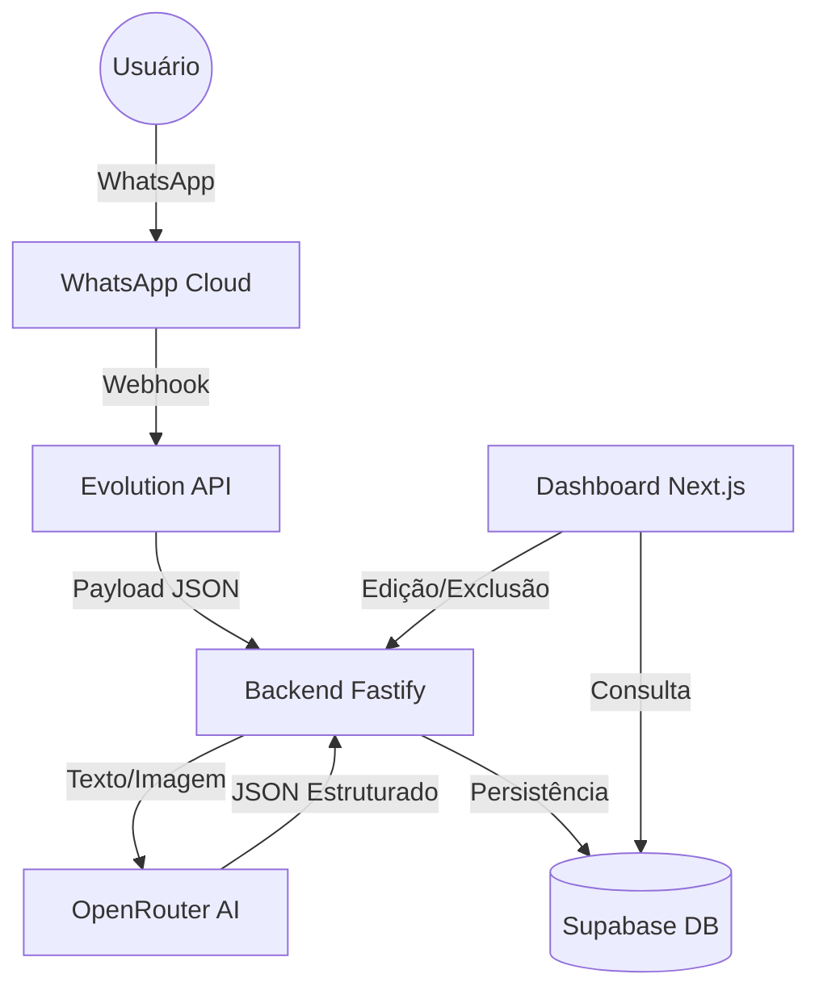

# 🧘 FinanZen: Gestão Financeira Inteligente via WhatsApp

O **FinanZen** é um ecossistema de gestão financeira pessoal que utiliza Inteligência Artificial para transformar mensagens simples de WhatsApp e fotos de comprovantes em registros financeiros organizados e dashboards interativos.

---

## 🚀 Visão Geral

O sistema permite que o usuário registre gastos e receitas sem a necessidade de abrir aplicativos complexos. Basta enviar uma mensagem como *"Gastei 50 no almoço"* ou uma foto de um recibo, e a IA processa, categoriza e armazena os dados automaticamente.

### 🛠️ Tecnologias Utilizadas

| Camada | Tecnologia |
| :--- | :--- |
| **Frontend** | Next.js 14, TailwindCSS, Lucide Icons, Recharts |
| **Backend** | Fastify (Node.js), Prisma ORM, Zod |
| **Banco de Dados** | PostgreSQL (Supabase) |
| **IA & Visão** | OpenRouter (Gemini 2.0 Flash / Llama 3.2 Vision) |
| **Integração WhatsApp** | Evolution API v2 |

---

## 📐 Arquitetura do Sistema



---

## ✨ Funcionalidades Principais

- **Extração Inteligente:** Processamento de linguagem natural para entender frases complexas.
- **Visão Artificial:** Leitura automática de comprovantes, prints e notas fiscais.
- **Whitelist de Segurança:** Somente números autorizados podem realizar registros.
- **Dashboard Interativo:** Visualização de fluxo de caixa, saldo e gastos por categoria.
- **Gestão Completa:** Interface para editar, excluir e buscar transações.
- **De-duplicação:** Sistema inteligente que ignora mensagens repetidas do WhatsApp.

---

## ⚙️ Configuração e Instalação

### Pré-requisitos
- Node.js 18+
- Docker & Docker Compose
- Conta no Supabase & OpenRouter

### Passos para Instalação

1. **Clonar o repositório:**
   ```bash
   git clone <repo-url>
   ```

2. **Configurar o Backend:**
   - Acesse a pasta `backend`.
   - Crie um arquivo `.env` baseado nas variáveis abaixo:
     ```env
     DATABASE_URL="..."
     OPENROUTER_API_KEY="..."
     ALLOWED_NUMBERS="5561..."
     EVOLUTION_API_KEY="..."
     ```
   - Execute `npm install` e `npx prisma db push`.

3. **Subir a Infraestrutura (Evolution API):**
   - Acesse a pasta `evolution`.
   - Execute `docker-compose up -d`.

4. **Configurar o Frontend:**
   - Acesse a pasta `frontend`.
   - Execute `npm install` e `npm run dev`.

5. **Atalho na Área de Trabalho:**
   - Execute o script `CriarAtalho.ps1` no PowerShell para criar um atalho profissional com o ícone oficial do **FinanZen**.

---

## 🎨 Identidade Visual
O **FinanZen** utiliza uma estética moderna de **Glassmorphism**. 
- **Ícone Oficial:** Carteira Digital Premium (Opção 2).
- **Favicon:** Implementado no dashboard para uma experiência web completa.

---

## 🔒 Segurança

O sistema implementa uma camada de segurança via **Whitelist**. Mesmo que sua instância da Evolution API seja exposta, o backend rejeitará qualquer requisição vinda de números não configurados no `.env`.

---

---

## 🛠️ Manutenção e Estabilidade

Recentemente, o sistema passou por uma auditoria de performance para garantir rodar de forma leve em diversas máquinas:
- **Gestão de Processos:** Script de inicialização otimizado para Windows (`FinanZen.vbs`) usando detecção via `tasklist`.
- **Limites de Memória:** Configurado para consumo consciente (512MB Backend / 1GB Frontend).
- **GPU Friendly:** Dashboard otimizado para renderização suave com filtros de desfoque balanceados.

---

## 📝 Licença
Este projeto é para uso pessoal e educacional. Desenvolvido com foco em UX e automação inteligente.

